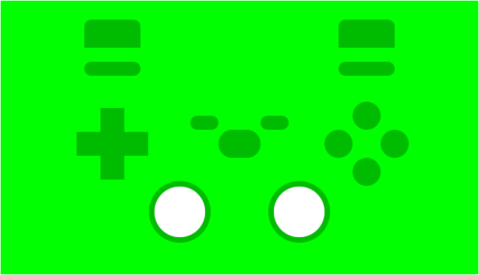

# Fightsticker

Fightsticker is a program to display fightstick inputs for streaming and
testing purposes. Fightsticker is available on Windows, macOS, and Linux.

## Install

Go to the [Releases](https://github.com/zevlee/fightsticker/releases) section
of this repository to download the package for your preferred platform.

## Graphical User Interface

Upon starting the program, users are greeted with a user-friendly interface
from which they can launch the layout of their choice.

Within the preferences window, users can configure the deadzones for analog
sticks and triggers. Additionally, users can select custom configuration files
in the preferences window. Through these, users can select custom images for
the background and buttons as well as alter the placement of buttons as they
appear upon being activated.

## Layouts 

There are three layouts to choose from: Traditional, Leverless, and Pad. On
the Traditional and Leverless layouts, both the left stick and the dpad trigger
directional movements.

## Changes

This repo is a fork of
[Fightstick Display](https://github.com/calexil/FightstickDisplay) by
[calexil](https://github.com/calexil). The repository was forked at the
following commit:
[`b97e2569af7df710f24c7cd96570c092570381c5`](https://github.com/calexil/FightstickDisplay/tree/b97e2569af7df710f24c7cd96570c092570381c5)

Fightsticker makes changes to the structure and operation of the original
program. The differences are detailed below.

**No Prerequisites**

Users are not required to have Python installed on their system, as
Fightsticker comes in a bundle ready to be installed by the user on their
preferred operating system.

**Graphical User Interface**

The GUI to launch the program is entirely new. Because the deadzones for analog
sticks and triggers are now accessible through the preferences window, the
original deadzone configuration scene accessible through pressing the guide
button on the controller has been removed.

**Default Layouts**

The default layouts feature an all-green background, as they are intended to be
chroma-keyed out using streaming software. The Pad layout is entirely new.

**Configuration Files**

Configuration files are now stored in the preferred configuration area for the
operating system on which the program is run, as opposed to within a local
`theme` directory. Within this configuration directory, layouts and images are
stored in the `layouts` and `images` directories, respectively.

**Dependencies**

While the original program used a vendored version of `pyglet`, Fightsticker
uses the latest version and keeps it as a separate dependency. The package
`platformdirs` is used to manage the storage of configuration files.

**Structure**

The `fightstick.py` and `fightstick_hb.py` files have been combined. There are
now `TraditionalScene`, `LeverlessScene`, and `PadScene` classes which inherit
from a general `LayoutScene` class where common methods between the layouts are
stored.
